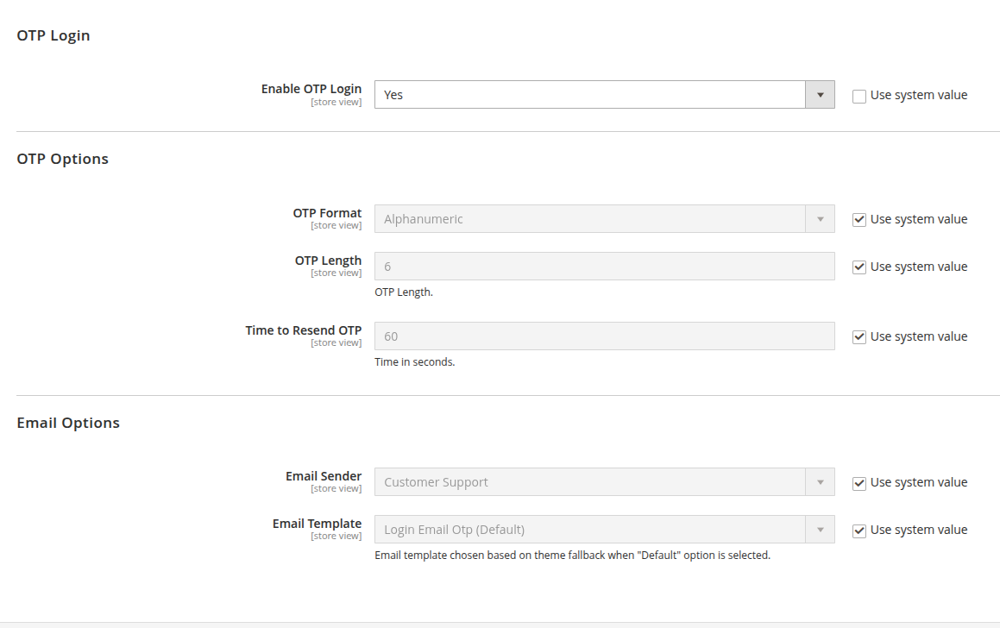
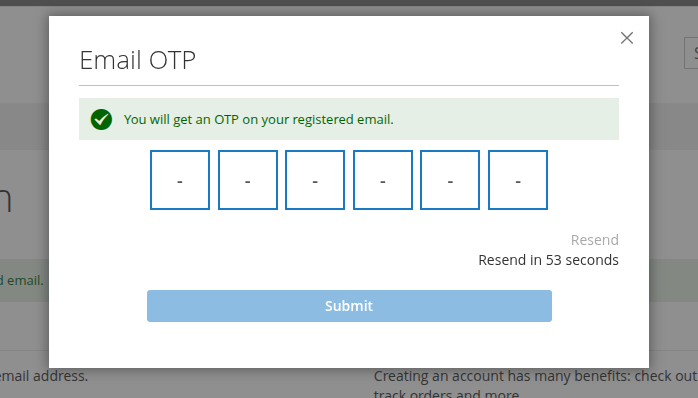
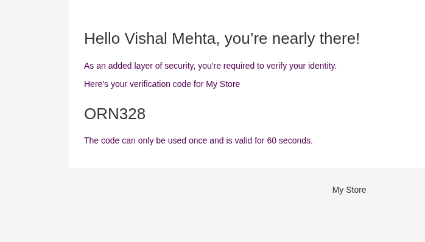

# Customer Login using OTP Validation

This module enables secure customer login via One-Time Password (OTP) sent to their registered email. This module enhances account security and simplifies the login experience on your Magento 2 store.

# Unique Offerings
* Customizable OTP Expiry and Length
* Login Attempt Monitoring
* Guest to Customer Conversion
* Multi-Store & Multi-Language Support

# Direct Benefits
* Simplified Login Experience
* Enhanced Security
* Reduced Risk of Account Lockout

# Indirect Benefits
* Improved User Trust
* Higher Engagement & Retention
* Reduced Support Requests

# What About the Pricing?
* It's completely **FREE OF CHARGE**.

# Compatibility with Magento Versions
* Magento 2.4.X (CE, EE)

# Features
* OTP Based Customer Login
* Email OTP Support
* OTP Expiry Time Configuration
* Time to Re-Send OTP Configuration
* OTP Length and Format Settings
* Customizable OTP Email Templates
* Multi-Store & Multi-Language Support
* GraphQL Support

**OTP Screen**

**Email Message**

